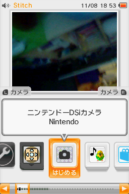
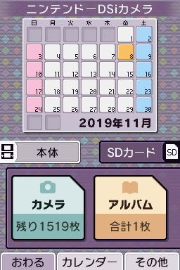
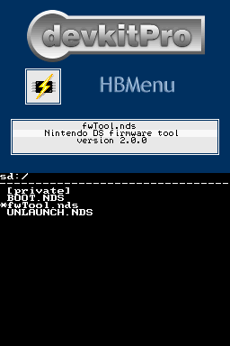
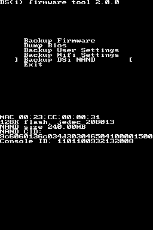
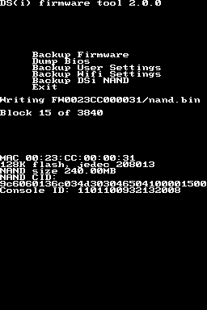
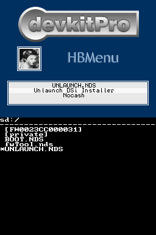
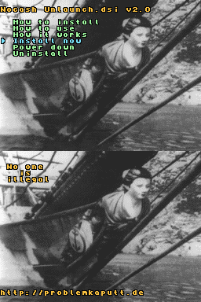
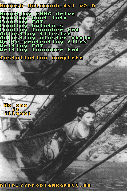
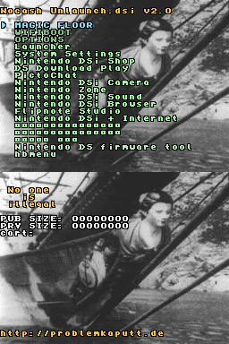

# Installation de Unlaunch

Unlaunch is a DSi bootcode exploit which will allow you to run HiyaCFW, a DSi Custom Firmware, and homebrew with full access to your console.

## Ce dont vous avez besoin
* La dernière version de Unlaunch
* La dernière version du HBMenu
* La dernière version de Flipnote ( ͡° ͜ʖ ͡°) (“Flipnote Lenny”)
   * Nous n'avons pas besoin de Flinote Studio sur la DS
* La dernière version de Memory Pit
  * pour firmware 1.0 - 1.3 (USA, EUR, AUS, JPN)
  * pour firmware 1.4 - 1.4.5 (USA, EUR, AUS, JPN)
  * pour firmware 1.0 - 1.4.6 (KOR, CHN)
  
## Création de la nand backup
  
1. Lancez l'application DSi Camera
2. Vérifier que vous êtes dans l'onglet `Carte SD` puis sélectionner `Album`, Vous devriez aboutir sur l'application de la 3ème image
    * Si ce n'est pas le cas revérifier vos fichiers sur la carte sd
3. Sélectionnez `fwtool.nds`

4. Un fois dans Fwtool sélectionnez `Backup DSi Nand`, puis attendez ça devrait prendre une dizaine de minutes
    * la backup est finie lorsque `saved nand.bin.sha1.` apparait
5. Sélectionnez `Exit` et éteignez la console

## Installation d'Unlaunch

1. Refaites les deux premières étapes de la partie précédente pour relancer le HBMenu
2. Sélectionnez `UNLAUNCH.NDS`,le menu de la 2ème photo devrait apparaitre

3. Sélectionnez `Install Now`
4. Le menu de la dernière image devrait apparaître lorsque vous démarrez la console

